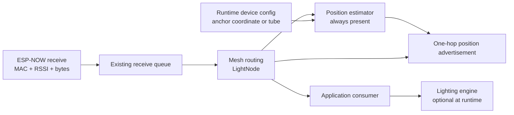

# Distributed positioning on Tubes devices

Status: design proposal only. This document describes how to turn the positioning experiment in [index.html](index.html) into ESP32 firmware. It intentionally does not implement the protocol.

## Objective

Every device runs the same mesh and positioning code. A device:

- knows only its own persistent `MeshId`, boot-local state, configuration, and clock;
- receives unpredictable broadcasts from immediate radio neighbors;
- measures RSSI only for the ESP-NOW frame it directly received;
- never knows the total device count or the complete network topology;
- maintains a bounded amount of information about recently useful neighbors;
- broadcasts its own current position belief so nearby devices can improve theirs;
- runs either as an ordinary tube or as a configured fixed-position anchor;
- may have lights, but positioning and mesh participation do not depend on having lights.

The smaller no-light units are anchors. In hardware, an anchor is configured with a surveyed position in a shared installation coordinate system. In the simulator, its estimated position is always its true physical position. An anchor still receives, transmits, routes, and measures RSSI, but it never lets radio observations move its own position.

When anchors are reachable, the intended result is a coarse map expressed in their installation frame. When no anchor is reachable, devices fall back to an anchor-free relative frame in which the component chooses its own origin, X axis, and positive-Y side.

## What the existing code already provides

The design should extend the existing behavior rather than create a second network stack.

- [`node.h`](../node.h) defines a fixed `NodeMessage` with a 64-byte data area, the sender's `id`, the sender's current `uplinkId`, recipients, timebase, and command.
- The ESP-NOW callback reaches `LightNode::onPeerData()` with the immediate sender's MAC address and RSSI.
- The current relay implementation replaces the message header with its own header before transmitting. The intended lighting behavior is instead transparent: preserve the accepted leader's logical header while ESP-NOW's receive metadata continues to identify the physical transmitter.
- `RECIPIENTS_INFO` is accepted by every receiver and is deliberately excluded from rebroadcasting.
- [`espnow_broadcast.cpp`](../../../wled00/espnow_broadcast.cpp) moves received packets out of the Wi-Fi callback into a small main-loop queue. Position calculations must stay out of the Wi-Fi callback.
- [`controller.h`](../controller.h) receives only a command and payload. It no longer has the RSSI or immediate-sender identity needed for ranging.

These facts determine the integration point: positioning belongs beside `LightNode`, below the lighting controller and above the ESP-NOW transport.



## Core protocol decision

Use a dedicated `COMMAND_POSITION` packet with `RECIPIENTS_INFO`.

Do not relay a position packet verbatim. The RSSI belongs to the physical transmitter of the received ESP-NOW frame. If device B rebroadcasts device A's position payload and device C treats C's RSSI as a range to A, the geometry is false.

Instead:

1. B receives A's position advertisement and measures a B-to-A range.
2. B updates its own position belief.
3. On B's next scheduled position transmission, B advertises B's belief using B's normal message header.
4. C measures a C-to-B range and combines that range with B's advertised coordinates.

This still propagates knowledge across multiple hops, but every range edge is always between two devices that directly heard each other.

The real firmware already uses command value `0x50` for `COMMAND_BEATS`, although the simulator currently uses that value for position. A real implementation should allocate a new value such as `0x60` after checking the rebased codebase for conflicts.

Position should not overload `COMMAND_INFO`; that command already carries `NodeInfo`.

## Device modes and lighting independence

The same firmware can support full tubes and smaller no-light units with a runtime capability flag such as `hasLights`.

Use a separate positioning mode rather than inferring all behavior from `hasLights`:

- `estimated`: an ordinary tube whose position is solved from received observations;
- `anchor`: normally a no-light unit with configured fixed coordinates.

The expected product configuration makes no-light units anchors, but keeping `hasLights` and `positionMode` distinct avoids coupling unrelated concerns and permits a diagnostic anchor with lights or a temporary no-light relay.

All units should:

- run ESP-NOW;
- run mesh leader/follower and relay behavior;
- validate and route lighting messages;
- run the position estimator;
- send position advertisements.

Only units with `hasLights` should apply lighting commands to LEDs.

An anchor's position is authoritative configuration. It advertises `position-valid`, `settled`, and maximum coordinate confidence immediately after the network starts. It may still calculate residuals to neighbors for diagnostics, but it never runs a solver update on its own coordinates.

The current `MessageReceiver::onCommand()` boolean also controls whether `LightNode` proceeds to rebroadcast a message. That couples application behavior to routing. Before supporting no-light relays, separate these meanings:

- the mesh layer decides whether a structurally valid packet may be relayed;
- the optional application consumer decides whether to render it;
- ignoring a lighting command locally must not prevent a small unit from relaying it.

This can be done without giving either device type a different network or positioning implementation.

## Per-device state

No global device registry is required. Each ESP32 owns only the following state.

### Local position belief

| Field | Meaning |
| --- | --- |
| `frame` | Anchored installation frame or floating fallback frame currently followed |
| `positionMode` | Configured anchor or estimated device |
| `axisId` | Device defining the positive X axis, or zero |
| `orientationId` | Device defining the positive-Y side, or zero |
| `solution` | Anchor, unplaced, radial, axis, mirrored, orientation, positioned, or adjusting |
| `xCm`, `yCm` | Current estimated coordinates in the elected frame |
| `confidence` | Bounded quality score, not a statistical guarantee |
| `constraintCount` | Fresh direct ranges used in the latest solve |
| `residualCm` | Range-fit residual from the latest solve |
| `settled` | Whether recent updates have become small and consistent |
| `positionSequence` | Increments whenever the advertised belief materially changes |

Coordinates should use centimeters on the wire. Signed 16-bit centimeters cover approximately +/-327 meters, which is ample for the installation while keeping packets small. The solver may use `float` internally on ESP32.

### Anchor configuration

Every device has a positioning configuration. For an ordinary tube, only calibration and capability fields are required. An anchor additionally requires:

- a nonzero installation frame namespace;
- an installation frame epoch;
- fixed `xCm` and `yCm` coordinates;
- an anchor-enabled flag;
- its normal radio calibration.

All anchors in one installation must use the same frame namespace, epoch, units, axis directions, and origin convention. Coordinates can be entered through the usermod JSON configuration, provisioning firmware, or another persistent configuration path. The wire protocol does not discover surveyed coordinates automatically.

Changing an anchor coordinate is a deployment change. Increment the installation frame epoch on every anchor so ordinary devices discard estimates made against the previous survey.

At startup an anchor sets its belief directly from this configuration. In the simulator only, dragging an anchor changes both its physical coordinate and its authoritative advertised coordinate. On hardware, physically moving an anchor without updating its configured coordinate makes the map wrong and should be treated as an installation fault.

### Coordinate-frame identity

A frame is identified by:

```text
frame kind + frame namespace + frame epoch
```

- An anchored frame uses a configured 32-bit installation namespace. It is stable across anchor reboots.
- A floating frame derives its namespace from the elected origin's `MeshId` and boot nonce.
- A locally solvable anchored frame always outranks a floating frame, regardless of device IDs. Underconstrained anchored evidence is retained without destroying the current floating belief.
- `frame epoch` changes when surveyed anchor coordinates change or, in a floating frame, when the origin changes its axis or orientation references.

The advertisement also names a heartbeat owner and sequence. In a floating frame the owner is the elected origin. In an anchored frame it is the highest fresh anchor ID learned for that namespace. A lower anchor may take over heartbeat ownership after the previous owner expires without changing coordinates, because the namespace and survey epoch remain the same.

Other devices propagate the newest owner and heartbeat sequence in their own advertisements. A node expires a remote frame if it has not seen that sequence advance for a lease period. Merely hearing neighbors repeat an old sequence must not keep a dead origin or absent anchor set alive forever.

### Fixed-size direct-peer table

Use a compile-time array, not `std::map` and not an unbounded history. The simulator now defaults to four entries to stress the smallest useful table; firmware capacity should remain compile-time configurable and be validated against expected installation density.

Each entry needs approximately:

- immediate sender `MeshId` and sender boot nonce;
- the sender's advertised frame, anchor flag, references, coordinates, solution, and quality;
- last position sequence and last-heard time;
- filtered RSSI mean and variance;
- derived direct range and range variance;
- sample count and an outlier flag.

The table represents recently useful immediate neighbors, not every device in the installation.

When full, evict the stale entry with the lowest usefulness score. Protect fresh direct anchors first, then the floating-frame origin, axis, and orientation. A possible score combines freshness, anchor authority, sample maturity, advertised confidence, range variance, and geometric usefulness. Expire an entry from solving after roughly six missed advertisement periods; reclaim it later after a longer retention interval.

The exact size must be confirmed with `sizeof()` on the target toolchain. A target of roughly 32-48 bytes per entry keeps a 16-peer table below about 1 KiB.

## Proposed wire advertisement

The following is a layout proposal, not C++ to paste into the project. The real declaration should use explicit-width integers, one-byte packing, validation, and a `static_assert` on its size.

| Field | Bytes | Purpose |
| --- | ---: | --- |
| Payload version | 1 | Evolves positioning independently of `NodeMessage` |
| Payload size | 1 | Allows safe validation and future extension |
| Solution | 1 | Current solution class |
| Flags | 1 | Valid, settled, anchor, anchored-frame, can-orient, has-lights, etc. |
| Sender boot nonce | 2 | Distinguishes reincarnations of the same sender ID |
| Frame namespace | 4 | Configured site frame or derived floating-frame identity |
| Frame owner ID | 2 | Current anchor authority or floating origin |
| Frame owner boot nonce | 2 | Distinguishes heartbeat-owner reboots |
| Frame epoch | 2 | Survey revision or floating-reference revision |
| Frame heartbeat sequence | 2 | Proves a frame authority is still alive |
| Axis ID | 2 | Positive-X reference, zero if absent |
| Orientation ID | 2 | Positive-Y reference, zero if absent |
| X centimeters | 2 | Sender's estimated X |
| Y centimeters | 2 | Sender's estimated Y |
| Confidence | 1 | 0-255 quality score |
| Constraint count | 1 | Number of fresh direct ranges used |
| Residual centimeters | 2 | `0xFFFF` when unavailable |
| TX calibration quarter-dB | 1 | Sender-specific offset from nominal TX calibration |
| Frame hop | 1 | Diagnostic and loop-sanity value |
| Position sequence | 2 | Sender's position revision |
| Leader via ID | 2 | Physical sender of this device's latest valid lighting-leader state; zero while waiting |

Total: 36 bytes, leaving room in the current 64-byte `NodeMessage::data` area.

Keep the outer `CURRENT_NODE_VERSION` unchanged for the first experiment if mixed old/new firmware must continue exchanging lighting traffic. An old node will see an unknown information command and ignore it. Position payload versioning handles changes within the new command. Increment the outer version only for an intentional incompatible mesh migration.

## Frame formation without device counts

### Anchored frame preference

An anchor starts immediately in its configured anchored frame and advertises its fixed coordinates. It does not begin at `(0, 0)` unless that is its surveyed coordinate.

An estimated device that receives a fresh anchored-frame advertisement records the anchored constraint immediately, even if the anchor's `MeshId` is lower than the current floating origin. It keeps its active floating estimate while the anchored evidence describes only a circle or mirror pair. Once its own peer table contains enough fresh, non-collinear anchored-frame constraints for a unique solution, it adopts the installation frame and resets the superseded floating estimate.

Anchored-frame knowledge propagates through ordinary devices after they have a valid anchored position, because every device advertises its own belief and adopted frame. The anchor packet itself is still never relayed. A tube several hops away may therefore enter the installation frame and localize from already-positioned neighbors without ever measuring an anchor directly.

Do not combine coordinates or range constraints from different frame namespaces or epochs. Hearing two anchored namespaces is a configuration fault. A non-anchor may select one deterministically so the state machine converges, but it must log the conflict and ignore peers in the other frame. A configured anchor never leaves its own namespace because another anchor advertises a different one.

### Startup without an anchor

An estimated device that has not heard a fresh anchor starts as the origin of its own floating frame:

```text
origin = my MeshId
position = (0, 0)
solution = origin
```

If it is the only device, that belief remains internally correct. No special discovery period or expected node count is needed. This floating behavior is a fallback, not the preferred installed state.

### Merging frames

Within floating mode, advertisements carry the sender's derived frame namespace and origin owner. A node adopts the fresh floating frame with the higher origin `MeshId`. Thus knowledge of a higher origin can move one hop per advertisement even when most devices cannot hear the origin directly.

This is not a claim that the receiver measured a range to the remote origin. It is only frame election. Ranging still applies exclusively to the immediate sender.

When two disconnected floating components meet, the lower-origin component resets into the higher-origin frame. When either component can uniquely solve in a valid anchor frame, the anchor frame wins over both. Merely hearing one underconstrained anchor does not discard the floating component's existing relative map.

If the selected origin heartbeat stops advancing and its lease expires, a device returns to its own frame and repeats normal election. No device needs to determine how many peers disappeared.

## Geometry with fixed anchors

Anchor coordinates define the installation's translation, rotation, scale, and positive-Y direction. An estimated device still needs enough independent distance constraints to observe its own point in that frame.

- One fixed anchor gives one circle. The device knows its range from a known point but not its direction.
- Two distinct fixed anchors normally give two mirror candidates across the line between them.
- Three non-collinear fixed anchors give a unique 2-D range solution, subject to RSSI error.
- Positioned non-anchor neighbors can provide additional constraints, so a device does not need to hear every anchor directly.

No node needs to know that exactly three anchors exist. It simply solves when its current fixed-size peer table contains enough fresh, non-collinear, same-frame constraints. If only one or two are locally useful, it reports radial or mirrored anchored evidence while preserving its active floating estimate.

Anchor coordinates are fixed constraints. The solver may down-weight a noisy RSSI range to an anchor, but it must never average, nudge, or otherwise modify the anchor's advertised coordinate. Multiple anchors with the same namespace but incompatible coordinates will appear as persistently large residuals and should trigger diagnostics rather than self-correction.

Choose anchor locations with good geometry: widely separated, non-collinear, and not all behind the same obstruction. Three anchors are the minimum for a directly observed 2-D point; additional anchors add redundancy against RSSI bias and packet loss.

## Floating fallback: origin, rotation, and reflection

The following election is used only while no anchored frame is reachable. Distances alone cannot determine global translation, rotation, or reflection, so the floating protocol defines these degrees of freedom rather than pretending to measure them.

### Floating origin

The elected origin is always `(0, 0)`.

### Floating axis with two devices

The origin selects a qualified direct neighbor as `axisId`. Selection should be deterministic—prefer a fresh, mature, low-variance link, then use the highest `MeshId` as a tie-breaker.

The axis device places itself at:

```text
(range-to-origin, 0)
```

This makes the two-device case stable. It does not claim that positive X corresponds to any real compass direction.

If the axis disappears, the origin selects another and increments the frame epoch. Every node then solves again in the new frame.

### Floating orientation with three devices

A non-origin, non-axis node that directly hears both origin and axis can compute two circle intersections. Those candidates are mirror images across the X axis.

Such a node advertises a `can-orient` flag. The origin deterministically selects one qualified candidate as `orientationId` and increments the frame epoch. The selected orientation device defines itself to be the positive-Y intersection. That convention removes reflection ambiguity for the component.

Other nodes should not automatically choose positive Y merely because two circles produced a pair of candidates. They may resolve the pair only when they have a range to the orientation device, enough other positioned peers, or a previous unambiguous solution that remains valid. Otherwise they should advertise `mirrored` or `radial`, with `position-valid` clear.

Mirror resolution uses bounded local state. Score both candidates against fresh direct ranges to orientation or already positioned peers. Require a material residual advantage for several consecutive solver updates before selecting a branch; retain the selected branch until the opposite branch wins by the same sustained rule. This needs only two residual accumulators, a selected and pending branch bit, and a small confirmation counter. It neither stores history nor consults total network membership. Protect fresh origin, axis, and orientation records from normal peer-table eviction so a small table does not discard the references that establish handedness.

### Inadequate floating geometry

If no device hears the links needed to form a non-collinear triangle, the network is not fully observable. The correct result is a partial solution:

- origin only: one point;
- origin plus axis: a line and radial circles;
- two positioned references: two mirror candidates;
- three or more non-collinear references: a 2-D solution.

Do not manufacture confidence to hide an unobservable topology.

## Processing a received position advertisement

The work occurs in the main loop after the existing ESP-NOW queue, never in the Wi-Fi callback.

For each valid `COMMAND_POSITION` packet:

1. Read the immediate sender from `message.header.id` and the measured RSSI supplied by ESP-NOW.
2. Reject self packets, invalid sizes, unsupported payload versions, impossible coordinates, stale sequences, and invalid RSSI sentinel values.
3. Detect sender reboot from its boot nonce and reset that peer's filter state.
4. Update or allocate the sender's fixed peer-table entry.
5. Filter the RSSI sample and update its variance.
6. Convert the filtered RSSI into a direct range using the sender's advertised TX calibration.
7. Validate anchor claims against frame namespace and epoch rules.
8. Prefer a fresh, locally solvable anchored frame; retain underconstrained anchored evidence while continuing floating-frame election and heartbeat processing.
9. If this device is an anchor, restore its configured coordinates and skip position solving.
10. Otherwise, recompute floating reference roles when applicable and run at most one bounded solver update using fresh, same-frame direct peers.
11. Mark the local advertisement dirty if the belief changed materially.

Lighting recipient rules do not apply to this estimator. Every valid position information packet is a local observation.

## Turning ESP32 RSSI into a range

The simulator currently inverts a chosen dropoff function perfectly. Hardware cannot do that. Start with the ordinary log-distance model:

```text
distance = referenceDistance * 10 ^ ((referenceRssi - measuredRssi) / (10 * pathLossExponent))
```

Where:

- `measuredRssi` is the ESP-NOW RSSI for the immediate sender;
- `referenceRssi` is the expected RSSI at the reference distance, adjusted by the sender's TX calibration;
- `pathLossExponent` is an installation-level configuration value;
- output is clamped to a physically useful minimum and maximum.

Filter RSSI in dB before converting it to distance. A starting filter can mirror the simulator's fixed-memory approach:

- use a running mean or EWMA;
- maintain running innovation variance;
- during the first few samples, converge quickly;
- after the filter matures, clamp or reject innovations beyond roughly three standard deviations;
- retain variance so unreliable links receive lower solver weight.

Keep Wi-Fi channel, data rate, antenna arrangement, and transmit-power configuration constant. The existing ESP-NOW transport already selects a fixed channel and configured TX power. Per-device one-meter calibration should be measured if possible and stored in configuration or EEPROM.

RSSI remains a coarse and biased range sensor. Multipath, antenna orientation, enclosures, people, and asymmetric radios can create persistent error that filtering cannot remove. The first hardware goal should be useful relative layout and neighborhood structure, not sub-meter truth.

## Local solver for four or more devices

Each device solves only for itself. It does not download or optimize a global graph.

The floating origin, axis, and orientation establish a shared coordinate convention; they are not required to remain direct ranging references. After bootstrap, every valid position advertisement in that frame is an ordinary potential constraint. A device beyond radio range of the origin can therefore localize from nearby positioned devices, then advertise its result to the next radio neighborhood.

Select fresh direct peers that:

- advertise the same frame identity and epoch;
- have a valid, non-ambiguous position;
- have sufficient confidence and mature RSSI samples;
- are not all nearly collinear.

Anchor peers carry authoritative coordinates and maximum coordinate confidence, but the local RSSI-derived range to an anchor retains its measured variance. Positioned ordinary peers receive lower weight and must propagate decreasing confidence with residual and uncertainty.

The number of usable direct constraints determines what may be claimed:

- one positioned peer produces a radial constraint centered on that peer, not necessarily the frame origin;
- two positioned peers produce two circle-intersection candidates around that local baseline;
- a third geometrically independent direct peer can resolve the mirror branch;
- three or more non-collinear positioned peers permit a unique local multilateration fit.

Mirrored and radial beliefs are advertised as ambiguous and are not themselves used as positioned constraints. This prevents an arbitrary provisional branch from propagating outward as if it were established geometry.

With three or more non-collinear positioned peers, solve weighted multilateration. The simulator uses a bounded robust fit suitable for an ESP32 implementation:

1. compute an initial weighted fit;
2. measure each range residual at that fit;
3. reduce the weight of inconsistent links;
4. compute one refined linear fit;
5. perform up to three bounded nonlinear range-residual corrections;
6. derive residual and geometry quality;
7. move only partway toward the result.

The solver is `O(P)` for `P` retained peers and uses a fixed number of scalar accumulators. It does not require a matrix library or heap allocation.

Use damping and a maximum update step so one packet cannot throw a stable estimate across the map. Increase damping when residual or RSSI variance is high. If geometry becomes singular or residual remains excessive, reduce confidence and retain the previous position rather than accepting a bad fit.

Confidence is a routing/visualization quality score, not a true covariance. It should depend on sample maturity, freshness, peer confidence, geometry, RSSI variance, and residual. A derived node must not become more confident than the references supporting it.

Repeated local updates and broadcasts produce distributed relaxation: a device improves from its direct neighbors, advertises that improvement, and later neighbors improve from it. No node ever needs to know the size of the connected component.

## Broadcast scheduling and traffic

Start with one position advertisement per active device per second, matching the simulator. Give every device a stable ID/boot-derived phase plus a small random jitter so devices do not transmit in lockstep.

Transmit immediately, subject to a short rate limit, when:

- adopting a new frame;
- the frame epoch changes;
- an anchor starts or its configured survey epoch changes;
- becoming floating axis or orientation;
- moving materially after being settled.

Do not send on every RSSI sample. A changed belief may wait for the normal position slot unless one of the events above occurred.

The current ESP-NOW receive queue holds only a small number of packets. Stress-test the one-second rate with the expected local density. Adaptive backoff based on local receive pressure can be added later, but is deliberately outside the first implementation. A device may observe local traffic pressure; it still must not assume that equals the total network size.

## Interaction with lighting leader/follower behavior

Lighting leadership, floating coordinate election, and anchor authority are different state machines.

- Lighting routing uses the logical leader ID, recipient rules, and relay timers. A follower does not retain an intermediate uplink, but it records the transient `leaderViaId` from the physical sender of its latest accepted leader state.
- Position frame propagation uses frame kind, namespace, authority heartbeat, frame epoch, and position quality.
- A relayed lighting packet preserves the accepted leader's header and timebase. A receiver therefore follows the same logical leader whether it heard the packet directly or through one or more relays.
- The physical transmitter remains available from the ESP-NOW receive callback's MAC/peer metadata. Diagnostics may record both identities: `logical leader F79 via physical transmitter 5E5`.
- A range is always associated with that physical transmitter, never with the lighting header's logical leader.
- A position advertisement is information traffic and is never relayed verbatim.
- Each relay periodically originates its own position advertisement under its own ID. The advertisement includes its `leaderViaId`, so a neighbor can distinguish direct leader reception, relayed reception, and a leader claim that has not yet produced a valid lighting state.
- A node renews relay duty when it hears a weaker leader claim, a same-leader neighbor still waiting for state, or a same-leader neighbor whose `leaderViaId` names this node. The lease expires after none of those locally observable conditions has occurred for the relay interval; no child list, route, tier, or population count is stored.
- Transparent relay forwarding uses bounded duplicate suppression. A small ring of recent `(leader ID, command, leader timebase)` fingerprints is sufficient for the simulator model and requires no topology or network-size knowledge; firmware should size the ring explicitly for available RAM and expected burst depth.
- In the current simulator policy, a non-anchor whose lighting uplink expires also invalidates the floating position frame learned through that leader. It clears its bounded peer table and restarts as a new local origin at `(0,0)`. A surveyed anchor retains its authoritative coordinate.

Keeping the state machines separate prevents a lighting topology change from silently reinterpreting coordinate meaning: loss of the authority path causes an explicit frame reset instead. Anchor authority outranks floating ID election. Reusing `MeshId` for deterministic tie-breaking is fine; reusing `uplinkId` as a measured position target is not.

## Partitions, joins, reboots, and movement

### Partition

Every partition containing a correctly configured anchor remains in the same installation namespace and coordinates. A partition with no fresh path to an anchor eventually falls back to its own floating frame. No partition can know that another component exists.

### Merge

An anchored component wins over a floating component. Two floating components use the higher fresh origin ID. Components advertising the same anchored namespace and epoch can combine without a coordinate reset; conflicting anchored namespaces remain isolated logically and raise diagnostics.

### Reboot

The sender boot nonce invalidates old peer-filter state. A floating origin reboot creates a new frame identity even if it happens to receive the same `MeshId`. An anchor reboot does not change its installation frame or coordinates; another fresh anchor may temporarily own the heartbeat.

### ID conflict

The existing immediate ID-conflict behavior remains authoritative. When a node chooses a new ID, it also chooses a new boot nonce, clears its peer table, and starts a new local frame.

### Physical movement

The estimator continues adjusting from fresh ranges. Persistent large innovations should clear `settled` and reduce confidence. Without an IMU, RSSI jitter and real movement cannot always be distinguished, so rapid motion tracking is outside the first target.

An anchor is different: its firmware continues advertising configured coordinates even if someone physically moves it. Large persistent residuals around that anchor are a fault signal, not permission to move its estimate.

## Simulator implications

The simulator represents the smaller units as configured anchors. The Devices toolbar can add them alongside ordinary tubes so anchor geometry and mixed radio paths can be exercised interactively.

- An anchor has the same radio, mesh ID, packet handling, RSSI measurements, and peer table as a tube.
- It has no lighting animation and ignores lighting rendering.
- Its advertised estimate is set to its simulator-only physical `(x, y)` every update.
- Dragging it changes its known position immediately, modeling an operator who has also updated the surveyed coordinate.
- A normal tube still has no access to any physical position, including its own.
- Anchor advertisements remain one-hop; tubes propagate the anchored frame only by advertising their own resulting beliefs.

This deliberate simulator exception models configured surveyed coordinates. It must not become a helper that exposes arbitrary tube positions to the estimator.

### Resource and quality evaluator

The simulator includes packaged field scenarios and explicit small-device limits so protocol variants can be compared under repeatable geometry.

- `peer slots` is a hard per-device ceiling; the simulator never allows the local table to grow beyond it;
- `solve with` separately caps how many retained peers participate in one solver update;
- `anchor reserve` protects a limited number of fresh direct anchors from ordinary eviction pressure;
- payload profile, coordinate encoding, coordinate resolution, packet envelope, and broadcast period produce modeled payload, packet, table-RAM, and traffic costs;
- advertised coordinates are actually quantized before a receiver stores or solves with them;
- profiles that carry TX calibration and quality fields allow the receiver to correct stable transmit bias and down-weight high-residual peers;
- independent scenario controls cover one through sixty-four tubes and zero through five anchors, allowing the same tube field to be rerun as an unanchored baseline and then with one, two, or three anchors.

The modeled peer-entry allocation represents a packed ESP32 target structure, not JavaScript heap usage. The compact envelope is an experimental smaller position packet. Selecting the current fixed envelope reports the existing 84-byte `NodeMessage` application size; reducing fields inside its 64-byte data area does not reduce that fixed packet without a transport-format change.

Quality is computed only by the simulator. It chooses one shared reference frame, applies the same display-only rigid registration used to compare an anchor-free map with physical truth, and then measures each uniquely positioned tube's error. Tubes in a different or ambiguous frame reduce coverage instead of being independently registered into a misleading perfect score. The overall score averages an exponential error score across every active tube, so missing coverage contributes zero. Median, 95th-percentile, worst error, coverage, peer pressure, and a bounded time history accompany the score.

A persistent-outlier detector records a device only after its registered error exceeds the configured threshold for the configured simulated duration. It retains recent events after recovery. Neither the score nor the outlier detector feeds information back into any device.

The simulator also keeps an unbounded, run-scoped message audit for causal analysis. Every broadcast produces one sender event and exactly one eventual outcome per other simulated device: delivered and accepted, delivered and ignored/rejected, probabilistically dropped, or outside hard range. Receive events retain the packet payload, routing decision, measured signal, position-processing result, relay action, and compact before/after snapshots of uplink, lighting DNA and schedule, and position belief. Local scheduled lighting changes and uplink timeouts are recorded beside message events because they can explain visible behavior without a new packet arriving. Scenario restart clears the audit; this history is simulator instrumentation and is not proposed as ESP32-resident state.

Tube count and anchor count are independent scenario inputs. This supports direct comparisons such as eight tubes with zero, one, two, and three anchors while holding deterministic tube placement constant. A future test runner can apply a fixed simulated duration, such as 30 seconds, and derive time-to-coverage, time-to-settle, stable-score duration, peer pressure, and persistent-outlier counts from the existing evaluator history and message audit.

## Suggested firmware boundaries

The names are illustrative; the important point is ownership.

| Component | Responsibility |
| --- | --- |
| Existing ESP-NOW transport | Receive queue, RSSI capture, broadcast send |
| Existing mesh/router (`LightNode`) | IDs, uplink, recipients, lighting relay behavior |
| New `PositionEstimator` | Peer table, anchored/floating frame state, RSSI filters, solver, advertisements |
| Application consumer | Apply lighting, buttons, BPM, updates when `hasLights` |
| Device profile | Runtime anchor mode, fixed coordinates, lighting capability, and radio calibration |

`PositionEstimator` should expose a narrow interface conceptually equivalent to:

```text
onDirectAdvertisement(senderId, senderMac, rssi, payload, now)
tick(now)
makeAdvertisement()
currentEstimate()
```

It should not know about LED patterns, WLED segments, relay direction, arbitrary physical truth, or the number of devices. Its only absolute coordinates come from local anchor configuration or validated anchor advertisements.

## Staged implementation plan

### Stage 1: Wire and observation only

- Add the new information command and versioned payload.
- Add runtime estimated/anchor configuration and frame namespaces.
- Broadcast fixed anchor coordinates or provisional floating beliefs on a randomized one-second schedule.
- Record bounded per-peer RSSI statistics and derived ranges.
- Expose serial diagnostics.
- Do not move estimates yet.

Success means every device reports only immediate senders and never attributes a relayed frame's RSSI to a remote leader.

### Stage 2: Anchored frame and fixed coordinates

- Make anchor coordinates immutable to the solver.
- Prefer a fresh anchored frame over every floating frame.
- Add anchored namespace, survey epoch, authority heartbeat, and expiry behavior.
- Verify that no-light anchors still route lighting traffic.

### Stage 3: One, two, and three anchor constraints

- One anchor produces a radial belief.
- Two anchors produce and retain mirror candidates.
- Three non-collinear anchors produce an installation-frame position.
- Preserve ambiguity whenever the locally available geometry is insufficient.

### Stage 4: Cooperative propagation and four-plus devices

- Add the fixed-size peer eviction policy.
- Add weighted two-pass multilateration, residuals, geometry checks, and damping.
- Let anchor-positioned tubes provide lower-confidence constraints to devices beyond direct anchor range.
- Let floating-frame positioned tubes do the same beyond direct origin range; origin, axis, and orientation remain frame metadata rather than mandatory solver inputs.
- Iterate from neighbor advertisements until stable without relaying anchor packets.

### Stage 5: Floating fallback

- Add floating origin election and heartbeat expiry.
- Add axis and orientation election for components with no reachable anchor.
- Reset from floating coordinates whenever an anchored frame becomes reachable.

### Stage 6: Real-radio calibration and resilience

- Collect static ESP32 measurements at known distances and orientations.
- Tune reference RSSI, path-loss exponent, filter rates, and confidence thresholds.
- Test partitions, merges, reboots, queue pressure, and moving people.
- Only then consider adaptive transmit intervals or online TX/path-loss estimation.

## Acceptance scenarios

The firmware design is ready for implementation when these scenarios have explicit expected outcomes:

1. **One estimated node with no anchor:** remains floating origin at `(0, 0)` indefinitely.
2. **One anchor:** always advertises its configured coordinate; an ordinary neighbor remains radial rather than inventing a direction.
3. **Two anchors:** an ordinary neighbor retains two mirror candidates unless another valid constraint resolves them.
4. **Three non-collinear anchors:** an ordinary neighbor converges in the surveyed installation frame.
5. **Moved anchor in simulation:** its advertised position follows its physical position exactly; normal tubes still cannot read physical coordinates.
6. **Moved anchor in hardware:** coordinates remain configured and residual diagnostics expose the mismatch.
7. **Floating two-node component:** one origin and one positive-X axis; their estimated separation matches the filtered range.
8. **Relayed-position neighborhood:** a device outside origin radio range converges from three directly heard, same-frame positioned peers; no relayed packet RSSI is attributed to the origin.
9. **Relayed two-reference neighborhood:** a device outside origin range retains two explicit mirror candidates and does not become a positioned constraint for devices farther away.
10. **Floating three-node component:** a stable orientation triangle forms; reflection is resolved by the elected orientation node.
11. **Collinear or poorly connected geometry:** the system reports partial/ambiguous geometry rather than false confidence.
12. **Four-plus dense nodes:** estimates converge through bounded local updates and stay stable under normal RSSI jitter.
13. **Multi-hop anchor path:** the installation frame propagates, but every range remains tied to an immediate sender.
14. **Table overflow:** low-value peers are evicted without evicting fresh direct anchors.
15. **Partition and merge:** anchorless partitions float; they reset into the anchored frame when connectivity returns.
16. **Anchor reboot:** its fixed frame survives while sender filter state and heartbeat ownership update safely.
17. **Small no-light anchor:** ignores rendering, keeps its configured position, and still routes valid lighting traffic.
16. **Positioning disabled or invalid:** existing lighting synchronization behaves exactly as before.

## Explicitly outside the first implementation

- automatic surveying of anchor coordinates;
- online movement or self-correction of configured anchors;
- absolute latitude/longitude or compass heading beyond the configured installation frame;
- simulator-only access to true physical coordinates for non-anchor devices;
- sub-meter accuracy guarantees from RSSI;
- online estimation of every transmitter power and path-loss parameter;
- a full distributed factor graph, particle filter, or global map database;
- storing every device ever heard;
- retransmitting another device's position packet as if it were locally measured;
- cryptographic authentication of anchor claims beyond the trust model of the existing mesh;
- changing lighting DNA based on position before position quality is characterized on hardware.

These can be revisited after the staged system demonstrates stable coarse relative geometry.

## Design basis and cautions

- The simulator implements the intended local pattern: direct range filtering, shared frame references, circle intersections, geometry checks, robust weighted multilateration, and damped convergence.
- [DGORL](https://arxiv.org/abs/2210.01662) demonstrates the broader distributed graph-optimization idea using RSSI-derived connectivity and relative ranges, but its motion and graph optimizer are beyond the first ESP32 scope here.
- [Experimental Validation of Cooperative RSS-based Localization](https://doi.org/10.1109/TWC.2024.3441643) shows why transmitter power and path-loss uncertainty matter and validates cooperative RSS measurements on a physical network.
- [Indoor Performance Evaluation of ESP-NOW](https://doi.org/10.1109/SIST58284.2023.10223585) shows that indoor reflections and obstacles materially affect ESP-NOW RSSI and delivery behavior.

The governing constraint remains simple: an estimated device may update its belief only from its previous local state, a packet it directly received, the RSSI attached to that reception, and bounded records of earlier direct receptions. A configured anchor is the sole exception: it owns one surveyed coordinate and never estimates or corrects that coordinate from the radio. Physical coordinates from the simulator must never enter an ordinary tube's firmware algorithm.
